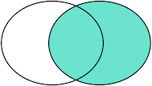

# 连接查询

连接查询是另一种类型的多表查询。连接查询对多个表进行JOIN运算，简单地说，就是先确定一个主表作为结果集，然后，把其他表的行有选择性地“连接”在主表结果集上。

例如，我们想要选出students表的所有学生信息，可以用一条简单的SELECT语句完成：
```sql
-- 选出所有学生
SELECT s.id, s.name, s.class_id, s.gender, s.score FROM students s;
```
但是，假设我们希望结果集同时包含所在班级的名称，上面的结果集只有class_id列，缺少对应班级的name列。

现在问题来了，存放班级名称的name列存储在classes表中，只有根据students表的class_id，找到classes表对应的行，再取出name列，就可以获得班级名称。

这时，连接查询就派上了用场。我们先使用最常用的一种内连接——INNER JOIN来实现：
```sql
-- 选出所有学生，同时返回班级名称
SELECT s.id, s.name, s.class_id, c.name class_name, s.gender, s.score
FROM students s
INNER JOIN classes c
ON s.class_id = c.id;
```
注意INNER JOIN查询的写法是：

先确定主表，仍然使用FROM <表1>的语法；
再确定需要连接的表，使用INNER JOIN <表2>的语法；
然后确定连接条件，使用ON <条件...>，这里的条件是s.class_id = c.id，表示students表的class_id列与classes表的id列相同的行需要连接；
可选：加上WHERE子句、ORDER BY等子句。
使用别名不是必须的，但可以更好地简化查询语句。

那什么是内连接（INNER JOIN）呢？先别着急，有内连接（INNER JOIN）就有外连接（OUTER JOIN）。我们把内连接查询改成外连接查询，看看效果：
```sql
-- 使用OUTER JOIN
SELECT s.id, s.name, s.class_id, c.name class_name, s.gender, s.score
FROM students s
RIGHT OUTER JOIN classes c
ON s.class_id = c.id;
```
执行上述RIGHT OUTER JOIN可以看到，和INNER JOIN相比，RIGHT OUTER JOIN多了一行，多出来的一行是“四班”，但是，学生相关的列如name、gender、score都为NULL。

这也容易理解，因为根据ON条件s.class_id = c.id，classes表的id=4的行正是“四班”，但是，students表中并不存在class_id=4的行。

有RIGHT OUTER JOIN，就有LEFT OUTER JOIN，以及FULL OUTER JOIN。它们的区别是：

INNER JOIN只返回同时存在于两张表的行数据，由于students表的class_id包含1，2，3，classes表的id包含1，2，3，4，所以，INNER JOIN根据条件s.class_id = c.id返回的结果集仅包含1，2，3。

RIGHT OUTER JOIN返回右表都存在的行。如果某一行仅在右表存在，那么结果集就会以NULL填充剩下的字段。

LEFT OUTER JOIN则返回左表都存在的行。如果我们给students表增加一行，并添加class_id=5，由于classes表并不存在id=5的行，所以，LEFT OUTER JOIN的结果会增加一行，对应的class_name是NULL：
```sql
-- 先增加一列class_id=5:
INSERT INTO students (class_id, name, gender, score) values (5, '新生', 'M', 88);
-- 使用LEFT OUTER JOIN
SELECT s.id, s.name, s.class_id, c.name class_name, s.gender, s.score
FROM students s
LEFT OUTER JOIN classes c
ON s.class_id = c.id;
```
最后，我们使用FULL OUTER JOIN，它会把两张表的所有记录全部选择出来，并且，自动把对方不存在的列填充为NULL：
```sql
-- 使用FULL OUTER JOIN
SELECT s.id, s.name, s.class_id, c.name class_name, s.gender, s.score
FROM students s
FULL OUTER JOIN classes c
ON s.class_id = c.id;
```
对于这么多种JOIN查询，到底什么使用应该用哪种呢？其实我们用图来表示结果集就一目了然了。

假设查询语句是：

```sql
SELECT ... FROM tableA ??? JOIN tableB ON tableA.column1 = tableB.column2;
```

我们把tableA看作左表，把tableB看成右表，那么INNER JOIN是选出两张表都存在的记录：


LEFT OUTER JOIN是选出左表存在的记录：


RIGHT OUTER JOIN是选出右表存在的记录：



FULL OUTER JOIN则是选出左右表都存在的记录：


## 小结
JOIN查询需要先确定主表，然后把另一个表的数据“附加”到结果集上；

INNER JOIN是最常用的一种JOIN查询，它的语法是SELECT ... FROM <表1> INNER JOIN <表2> ON <条件...>；

JOIN查询仍然可以使用WHERE条件和ORDER BY排序。