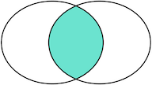

# 4.8 连接查询

连接查询是另一种类型的多表查询。连接查询对多个表进行JOIN运算，简单地说，就是先确定一个主表作为结果集，然后，把其他表的行有选择性地“连接”在主表结果集上。

例如，我们想要选出students表的所有学生信息，可以用一条简单的SELECT语句完成：

```sql
-- 选出所有学生
SELECT s.id, s.name, s.class_id, s.gender, s.score FROM students s;
```

但是，假设我们希望结果集同时包含所在班级的名称，上面的结果集只有class_id列，缺少对应班级的name列。

现在问题来了，存放班级名称的name列存储在classes表中，只有根据students表的class_id，找到classes表对应的行，再取出name列，就可以获得班级名称。

这时，连接查询就派上了用场。我们先使用最常用的一种内连接——INNER JOIN来实现：

```sql
-- 选出所有学生，同时返回班级名称
SELECT s.id, s.name, s.class_id, c.name class_name, s.gender, s.score
FROM students s
INNER JOIN classes c
ON s.class_id = c.id;
```

注意`INNER JOIN`查询的写法是：

- 先确定主表，仍然使用`FROM <表1>`的语法；
- 再确定需要连接的表，使用`INNER JOIN <表2>`的语法；
- 然后确定连接条件，使用`ON <条件...>`，这里的条件是`s.class_id = c.id`，表示`students`表的`class_id`列与`classes`表的`id`列相同的行需要连接；
- 可选：加上`WHERE`子句、`ORDER BY`等子句。

使用别名不是必须的，但可以更好地简化查询语句。

那什么是内连接（`INNER JOIN`）呢？先别着急，有内连接（`INNER JOIN`）就有外连接（`OUTER JOIN`）。我们把内连接查询改成外连接查询，看看效果：

```sql
-- 使用OUTER JOIN
SELECT s.id, s.name, s.class_id, c.name class_name, s.gender, s.score
FROM students s
RIGHT OUTER JOIN classes c
ON s.class_id = c.id;
```

执行上述`RIGHT OUTER JOIN`可以看到，和INNER JOIN相比，`RIGHT OUTER JOIN`多了一行，多出来的一行是“四班”，但是，学生相关的列如`name`、`gender`、`score`都为`NULL`。

这也容易理解，因为根据`ON`条件`s.class_id = c.id`，`classes`表的`id=4`的行正是“四班”，但是，`students`表中并不存在`class_id=4`的行。

有`RIGHT OUTER JOIN`，就有`LEFT OUTER JOIN`，以及`FULL OUTER JOIN`。它们的区别是：

`INNER JOIN`只返回同时存在于两张表的行数据，由于`students`表的`class_id`包含`1`，`2`，`3`，`classes`表的id包含`1`，`2`，`3`，`4`，所以，`INNER JOIN`根据条件`s.class_id = c.id`返回的结果集仅包含`1`，`2`，`3`。

`RIGHT OUTER JOIN`返回右表都存在的行。如果某一行仅在右表存在，那么结果集就会以`NULL`填充剩下的字段。

`LEFT OUTER JOIN`则返回左表都存在的行。如果我们给`students`表增加一行，并添加`class_id=5`，由于`classes`表并不存在`id=5`的行，所以，`LEFT OUTER JOIN`的结果会增加一行，对应的`class_name`是`NULL`：

```sql
-- 先增加一列class_id=5:
INSERT INTO students (class_id, name, gender, score) values (5, '新生', 'M', 88);
-- 使用LEFT OUTER JOIN
SELECT s.id, s.name, s.class_id, c.name class_name, s.gender, s.score
FROM students s
LEFT OUTER JOIN classes c
ON s.class_id = c.id;
```

最后，我们使用`FULL OUTER JOIN`，它会把两张表的所有记录全部选择出来，并且，自动把对方不存在的列填充为`NULL`：

```sql
-- 使用FULL OUTER JOIN
SELECT s.id, s.name, s.class_id, c.name class_name, s.gender, s.score
FROM students s
FULL OUTER JOIN classes c
ON s.class_id = c.id;
```

对于这么多种`JOIN`查询，到底什么使用应该用哪种呢？其实我们用图来表示结果集就一目了然了。

假设查询语句是：

```sql
SELECT ... FROM tableA ??? JOIN tableB ON tableA.column1 = tableB.column2;
```

我们把tableA看作左表，把tableB看成右表，那么`INNER JOIN`是选出两张表都存在的记录：



`LEFT OUTER JOIN`是选出左表存在的记录：


`RIGHT OUTER JOIN`是选出右表存在的记录：


`FULL OUTER JOIN`则是选出左右表都存在的记录：


## 小结
`JOIN`查询需要先确定主表，然后把另一个表的数据“附加”到结果集上；

`INNER JOIN`是最常用的一种`JOIN`查询，它的语法是`SELECT ... FROM <表1> INNER JOIN <表2> ON <条件...>`；

`JOIN`查询仍然可以使用`WHERE`条件和`ORDER BY`排序。